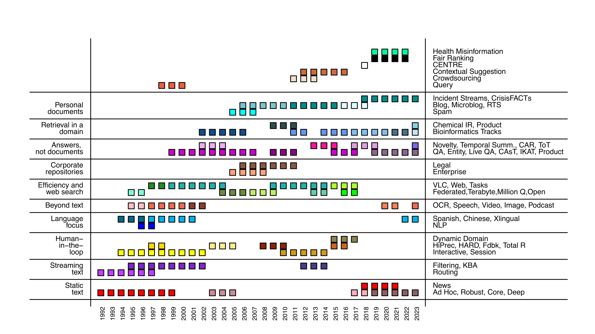

<h1>Text REtrieval Conference (TREC)</h1>

[`Proceedings`](./proceedings.md) __|__ [`Data`](./data.md) __|__ [`trec.nist.gov`](https://trec.nist.gov/)

## Adhoc
[`TREC-1 (1992)`](./trec1/overview.md) | [`TREC-2 (1993)`](./trec2/adhoc/overview.md) | [`TREC-3 (1994)`](./trec3/adhoc/overview.md) | [`TREC-4 (1995)`](./trec4/adhoc/overview.md) | [`TREC-5 (1996)`](./trec5/adhoc/overview.md) | [`TREC-6 (1997)`](./trec6/adhoc/overview.md) | [`TREC-7 (1998)`](./trec7/adhoc/overview.md) | [`TREC-8 (1999)`](./trec8/adhoc/overview.md)
## AToMiC
[`TREC-32 (2023)`](./trec32/atomic/overview.md)
## Blog
[`TREC-15 (2006)`](./trec15/blog/overview.md) | [`TREC-16 (2007)`](./trec16/blog/overview.md) | [`TREC-17 (2008)`](./trec17/blog/overview.md) | [`TREC-18 (2009)`](./trec18/blog/overview.md) | [`TREC-19 (2010)`](./trec19/blog/overview.md)
## CENTRE
[`TREC-27 (2018)`](./trec27/centre/overview.md)
## Chemical
[`TREC-18 (2009)`](./trec18/chemical/overview.md) | [`TREC-19 (2010)`](./trec19/chemical/overview.md) | [`TREC-20 (2011)`](./trec20/chemical/overview.md)
## Chinese
[`TREC-5 (1996)`](./trec5/Chinese/overview.md) | [`TREC-6 (1997)`](./trec6/chinese/overview.md)
## Clinical Decision Support
[`TREC-23 (2014)`](./trec23/clinical/overview.md) | [`TREC-24 (2015)`](./trec24/clinical/overview.md) | [`TREC-25 (2016)`](./trec25/clinical/overview.md)
## Clinical Trials
[`TREC-30 (2021)`](./trec30/trials/overview.md) | [`TREC-31 (2022)`](./trec31/trials/overview.md) | [`TREC-32 (2023)`](./trec32/trials/overview.md)
## Common Core
[`TREC-26 (2017)`](./trec26/core/overview.md) | [`TREC-27 (2018)`](./trec27/core/overview.md)
## Complex Answer Retrieval
[`TREC-26 (2017)`](./trec26/car/overview.md) | [`TREC-27 (2018)`](./trec27/car/overview.md) | [`TREC-28 (2019)`](./trec28/car/overview.md)
## Confusion
[`TREC-4 (1995)`](./trec4/confusion/overview.md) | [`TREC-5 (1996)`](./trec5/confusion/overview.md)
## Contextual Suggestion
[`TREC-21 (2012)`](./trec21/context/overview.md) | [`TREC-22 (2013)`](./trec22/context/overview.md) | [`TREC-23 (2014)`](./trec23/context/overview.md) | [`TREC-24 (2015)`](./trec24/context/overview.md) | [`TREC-25 (2016)`](./trec25/context/overview.md)
## Conversational Assistance
[`TREC-28 (2019)`](./trec28/cast/overview.md) | [`TREC-29 (2020)`](./trec29/cast/overview.md) | [`TREC-30 (2021)`](./trec30/cast/overview.md) | [`TREC-31 (2022)`](./trec31/cast/overview.md)
## CrisisFACTs
[`TREC-31 (2022)`](./trec31/crisis/overview.md) | [`TREC-32 (2023)`](./trec32/crisis/overview.md)
## Cross-Language
[`TREC-6 (1997)`](./trec6/clir/overview.md) | [`TREC-7 (1998)`](./trec7/xlingual/overview.md) | [`TREC-8 (1999)`](./trec8/xlingual/overview.md) | [`TREC-9 (2000)`](./trec9/xlingual/overview.md) | [`TREC-10 (2001)`](./trec10/xlingual/overview.md) | [`TREC-11 (2002)`](./trec11/xlingual/overview.md)
## Crowdsourcing
[`TREC-20 (2011)`](./trec20/crowd/overview.md) | [`TREC-21 (2012)`](./trec21/crowd/overview.md) | [`TREC-22 (2013)`](./trec22/crowd/overview.md)
## Database Merging
[`TREC-4 (1995)`](./trec4/dbmerge/overview.md) | [`TREC-5 (1996)`](./trec5/dbmerge/overview.md)
## Decision
[`TREC-28 (2019)`](./trec28/decisions/overview.md)
## Deep Learning
[`TREC-28 (2019)`](./trec28/deep/overview.md) | [`TREC-29 (2020)`](./trec29/deep/overview.md) | [`TREC-30 (2021)`](./trec30/deep/overview.md) | [`TREC-31 (2022)`](./trec31/deep/overview.md) | [`TREC-32 (2023)`](./trec32/deep/overview.md)
## Dynamic Domain
[`TREC-24 (2015)`](./trec24/domain/overview.md) | [`TREC-25 (2016)`](./trec25/domain/overview.md) | [`TREC-26 (2017)`](./trec26/domain/overview.md)
## Enterprise
[`TREC-14 (2005)`](./trec14/enterprise/overview.md) | [`TREC-15 (2006)`](./trec15/enterprise/overview.md) | [`TREC-16 (2007)`](./trec16/enterprise/overview.md) | [`TREC-17 (2008)`](./trec17/enterprise/overview.md)
## Entity
[`TREC-18 (2009)`](./trec18/entity/overview.md) | [`TREC-19 (2010)`](./trec19/entity/overview.md) | [`TREC-20 (2011)`](./trec20/entity/overview.md)
## Fair Ranking
[`TREC-28 (2019)`](./trec28/fair/overview.md) | [`TREC-29 (2020)`](./trec29/fair/overview.md) | [`TREC-30 (2021)`](./trec30/fair/overview.md) | [`TREC-31 (2022)`](./trec31/fair/overview.md)
## Federated Web Search
[`TREC-22 (2013)`](./trec22/federated/overview.md) | [`TREC-23 (2014)`](./trec23/federated/overview.md)
## Filtering
[`TREC-4 (1995)`](./trec4/filtering/overview.md) | [`TREC-5 (1996)`](./trec5/filtering/overview.md) | [`TREC-6 (1997)`](./trec6/filtering/overview.md) | [`TREC-7 (1998)`](./trec7/filtering/overview.md) | [`TREC-8 (1999)`](./trec8/filtering/overview.md) | [`TREC-9 (2000)`](./trec9/filtering/overview.md) | [`TREC-10 (2001)`](./trec10/filtering/overview.md) | [`TREC-11 (2002)`](./trec11/filtering/overview.md)
## Genomics
[`TREC-12 (2003)`](./trec12/genomics/overview.md) | [`TREC-13 (2004)`](./trec13/genomics/overview.md) | [`TREC-14 (2005)`](./trec14/genomics/overview.md) | [`TREC-15 (2006)`](./trec15/genomics/overview.md) | [`TREC-16 (2007)`](./trec16/genomics/overview.md)
## GIRT
[`TREC-8 (1999)`](./trec8/girt/overview.md)
## HARD
[`TREC-12 (2003)`](./trec12/hard/overview.md) | [`TREC-13 (2004)`](./trec13/HARD/overview.md) | [`TREC-14 (2005)`](./trec14/HARD/overview.md)
## Health Misinformation
[`TREC-29 (2020)`](./trec29/misinfo/overview.md) | [`TREC-30 (2021)`](./trec30/misinfo/overview.md) | [`TREC-31 (2022)`](./trec31/misinfo/overview.md)
## High-Precision
[`TREC-6 (1997)`](./trec6/hp/overview.md) | [`TREC-7 (1998)`](./trec7/hp/overview.md)
## Incident Streams
[`TREC-27 (2018)`](./trec27/incident/overview.md) | [`TREC-28 (2019)`](./trec28/incident/overview.md) | [`TREC-29 (2020)`](./trec29/incident/overview.md) | [`TREC-30 (2021)`](./trec30/incident/overview.md)
## Interactive
[`TREC-4 (1995)`](./trec4/interactive/overview.md) | [`TREC-5 (1996)`](./trec5/interactive/overview.md) | [`TREC-6 (1997)`](./trec6/interactive/overview.md) | [`TREC-7 (1998)`](./trec7/interactive/overview.md) | [`TREC-8 (1999)`](./trec8/interactive/overview.md) | [`TREC-9 (2000)`](./trec9/interactive/overview.md) | [`TREC-10 (2001)`](./trec10/interactive/overview.md) | [`TREC-11 (2002)`](./trec11/interactive/overview.md)
## Interactive Knowledge Assistance
[`TREC-32 (2023)`](./trec32/ikat/overview.md)
## Knowledge Base Acceleration
[`TREC-21 (2012)`](./trec21/kba/overview.md) | [`TREC-22 (2013)`](./trec22/kba/overview.md) | [`TREC-23 (2014)`](./trec23/kba/overview.md)
## Large Web
[`TREC-8 (1999)`](./trec8/web/overview.md)
## Legal
[`TREC-15 (2006)`](./trec15/legal/overview.md) | [`TREC-16 (2007)`](./trec16/legal/overview.md) | [`TREC-17 (2008)`](./trec17/legal/overview.md) | [`TREC-18 (2009)`](./trec18/legal/overview.md) | [`TREC-19 (2010)`](./trec19/legal/overview.md) | [`TREC-20 (2011)`](./trec20/legal/overview.md)
## LiveQA
[`TREC-24 (2015)`](./trec24/qa/overview.md) | [`TREC-25 (2016)`](./trec25/qa/overview.md) | [`TREC-26 (2017)`](./trec26/qa/overview.md)
## Medical
[`TREC-20 (2011)`](./trec20/medical/overview.md) | [`TREC-21 (2012)`](./trec21/medical/overview.md)
## Microblog
[`TREC-20 (2011)`](./trec20/microblog/overview.md) | [`TREC-21 (2012)`](./trec21/microblog/overview.md) | [`TREC-22 (2013)`](./trec22/microblog/overview.md) | [`TREC-23 (2014)`](./trec23/microblog/overview.md) | [`TREC-24 (2015)`](./trec24/microblog/overview.md)
## Million Query
[`TREC-16 (2007)`](./trec16/million-query/overview.md) | [`TREC-17 (2008)`](./trec17/million-query/overview.md) | [`TREC-18 (2009)`](./trec18/million-query/overview.md)
## NeuCLIR
[`TREC-31 (2022)`](./trec31/neuclir/overview.md) | [`TREC-32 (2023)`](./trec32/neuclir/overview.md)
## News
[`TREC-27 (2018)`](./trec27/news/overview.md) | [`TREC-28 (2019)`](./trec28/news/overview.md) | [`TREC-29 (2020)`](./trec29/news/overview.md) | [`TREC-30 (2021)`](./trec30/news/overview.md)
## NLP
[`TREC-5 (1996)`](./trec5/nlp/overview.md) | [`TREC-6 (1997)`](./trec6/nlp/overview.md)
## Novelty
[`TREC-11 (2002)`](./trec11/novelty/overview.md) | [`TREC-12 (2003)`](./trec12/novelty/overview.md) | [`TREC-13 (2004)`](./trec13/novelty/overview.md)
## OpenSearch
[`TREC-25 (2016)`](./trec25/open/overview.md) | [`TREC-26 (2017)`](./trec26/open/overview.md)
## Podcast
[`TREC-29 (2020)`](./trec29/podcast/overview.md) | [`TREC-30 (2021)`](./trec30/podcast/overview.md)
## Precision Medicine
[`TREC-26 (2017)`](./trec26/pm/overview.md) | [`TREC-27 (2018)`](./trec27/pm/overview.md) | [`TREC-28 (2019)`](./trec28/pm/overview.md) | [`TREC-29 (2020)`](./trec29/pm/overview.md)
## Product Search
[`TREC-32 (2023)`](./trec32/product/overview.md)
## Query
[`TREC-7 (1998)`](./trec7/query/overview.md) | [`TREC-8 (1999)`](./trec8/query/overview.md) | [`TREC-9 (2000)`](./trec9/query/overview.md)
## Question Answering
[`TREC-8 (1999)`](./trec8/qa/overview.md) | [`TREC-9 (2000)`](./trec9/qa/overview.md) | [`TREC-10 (2001)`](./trec10/qa/overview.md) | [`TREC-11 (2002)`](./trec11/qa/overview.md) | [`TREC-12 (2003)`](./trec12/qa/overview.md) | [`TREC-13 (2004)`](./trec13/qa/overview.md) | [`TREC-14 (2005)`](./trec14/qa/overview.md) | [`TREC-15 (2006)`](./trec15/qa/overview.md) | [`TREC-16 (2007)`](./trec16/qa/overview.md)
## Real-time Summarization
[`TREC-25 (2016)`](./trec25/realtime/overview.md) | [`TREC-26 (2017)`](./trec26/rts/overview.md) | [`TREC-27 (2018)`](./trec27/rts/overview.md)
## Relevance Feedback
[`TREC-17 (2008)`](./trec17/relfdbk/overview.md) | [`TREC-18 (2009)`](./trec18/relfdbk/overview.md) | [`TREC-19 (2010)`](./trec19/relfdbk/overview.md)
## Robust
[`TREC-12 (2003)`](./trec12/robust/overview.md) | [`TREC-13 (2004)`](./trec13/robust/overview.md) | [`TREC-14 (2005)`](./trec14/robust/overview.md)
## Routing
[`TREC-1 (1992)`](./trec1/overview.md) | [`TREC-2 (1993)`](./trec2/routing/overview.md) | [`TREC-3 (1994)`](./trec3/routing/overview.md) | [`TREC-4 (1995)`](./trec4/routing/overview.md) | [`TREC-5 (1996)`](./trec5/routing/overview.md) | [`TREC-6 (1997)`](./trec6/routing/overview.md)
## Session
[`TREC-19 (2010)`](./trec19/session/overview.md) | [`TREC-20 (2011)`](./trec20/session/overview.md) | [`TREC-21 (2012)`](./trec21/session/overview.md) | [`TREC-22 (2013)`](./trec22/session/overview.md) | [`TREC-23 (2014)`](./trec23/session/overview.md)
## Spam
[`TREC-14 (2005)`](./trec14/spam/overview.md) | [`TREC-15 (2006)`](./trec15/spam/overview.md) | [`TREC-16 (2007)`](./trec16/spam/overview.md)
## Spanish
[`TREC-4 (1995)`](./trec4/spanish/overview.md) | [`TREC-5 (1996)`](./trec5/Spanish/overview.md)
## Spoken Document Retrieval
[`TREC-6 (1997)`](./trec6/sdr/overview.md) | [`TREC-7 (1998)`](./trec7/sdr/overview.md) | [`TREC-8 (1999)`](./trec8/sdr/overview.md) | [`TREC-9 (2000)`](./trec9/sdr/overview.md)
## Tasks
[`TREC-24 (2015)`](./trec24/task/overview.md) | [`TREC-25 (2016)`](./trec25/task/overview.md) | [`TREC-26 (2017)`](./trec26/task/overview.md)
## Temporal Summarization
[`TREC-22 (2013)`](./trec22/tempsumm/overview.md) | [`TREC-23 (2014)`](./trec23/tempsumm/overview.md) | [`TREC-24 (2015)`](./trec24/tempsumm/overview.md)
## Terabyte
[`TREC-13 (2004)`](./trec13/terabyte/overview.md) | [`TREC-14 (2005)`](./trec14/terabyte/overview.md) | [`TREC-15 (2006)`](./trec15/terabyte/overview.md)
## Tip-of-the-Tongue
[`TREC-32 (2023)`](./trec32/tot/overview.md)
## Total Recall
[`TREC-24 (2015)`](./trec24/recall/overview.md) | [`TREC-25 (2016)`](./trec25/recall/overview.md)
## Very Large Corpus
[`TREC-6 (1997)`](./trec6/vlc/overview.md)
## Video
[`TREC-10 (2001)`](./trec10/video/overview.md) | [`TREC-11 (2002)`](./trec11/video/overview.md)
## Web
[`TREC-9 (2000)`](./trec9/web/overview.md) | [`TREC-10 (2001)`](./trec10/web/overview.md) | [`TREC-11 (2002)`](./trec11/web/overview.md) | [`TREC-12 (2003)`](./trec12/web/overview.md) | [`TREC-13 (2004)`](./trec13/web/overview.md) | [`TREC-18 (2009)`](./trec18/web/overview.md) | [`TREC-19 (2010)`](./trec19/web/overview.md) | [`TREC-20 (2011)`](./trec20/web/overview.md) | [`TREC-21 (2012)`](./trec21/web/overview.md) | [`TREC-22 (2013)`](./trec22/web/overview.md) | [`TREC-23 (2014)`](./trec23/web/overview.md)
